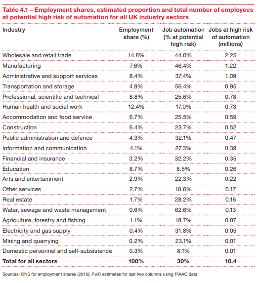
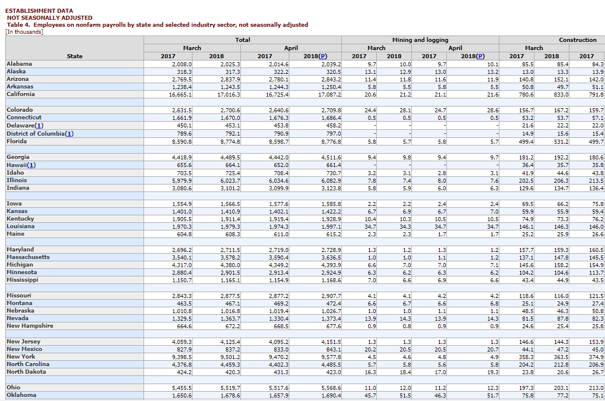
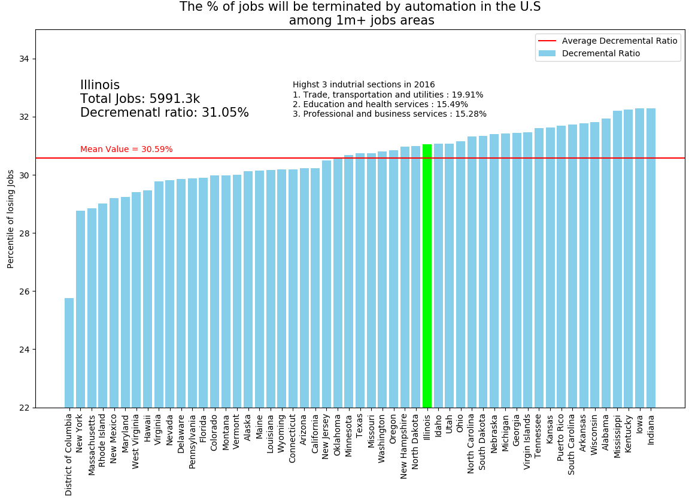

# How-much-jobs-will-be-terminated-by-automation

[Direct Link](JobTermination.ipynb)

## Used Data set

#### [ Will robots steal our jobs? /PWC UK economy outlook 2017](https://www.pwc.co.uk/economic-services/ukeo/pwcukeo-section-4-automation-march-2017-v2.pdf)

#### [Employees on nonfarm payrolls by state and selected industry sector/ Bureau of Labor Statistics](https://www.bl s.gov/news.release/laus.t04.htm)

## Result
(This is an interactive chart, but its laggy on jupyter notebook. Little bit buggy, and I can fix it:)

